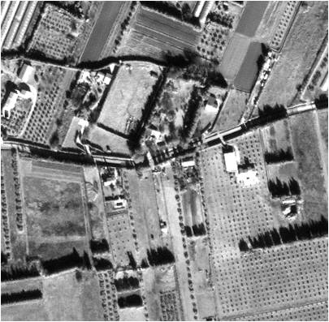
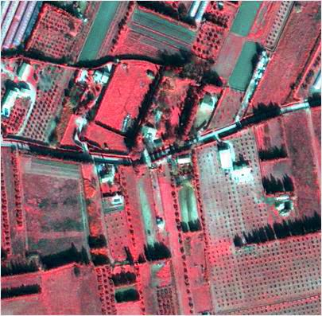

# FusionCNN
此仓库为论文[FusionCNN: a remote sensing image fusion algorithm based on deep convolutional neural networks](https://link.springer.com/article/10.1007/s11042-018-6850-3)的开源实现。论文中提出了一种新颖的遥感图像融合算法，这种方法能够很好的保留多光谱图像的光谱信息和全色图像的空间信息。
  
## 实验图像

**image 1**

ms image

pan image

fusion image

**image 2**

ms image

pan image

fusion image

  
高分辨率灰度图  
  
高分辨率彩色融合图  
  
  
  
低分辨率彩色图  
  
高分辨率灰度图  
  
高分辨率彩色融合图  

