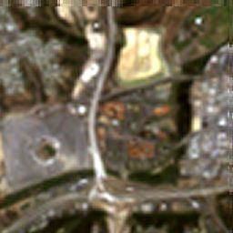
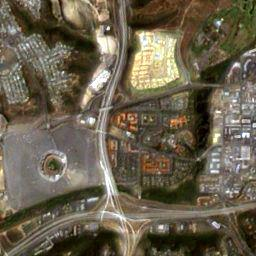

# FusionCNN
此仓库为论文[FusionCNN: a remote sensing image fusion algorithm based on deep convolutional neural networks](https://link.springer.com/article/10.1007/s11042-018-6850-3)的开源实现。论文中提出了一种新颖的遥感图像融合算法，这种方法能够很好的保留多光谱图像的光谱信息和全色图像的空间信息。
  
## 实验图像

**image 1**

ms image


pan image


fusion image


**image 2**

ms image



pan image


fusion image



## 实验说明
**训练模型**
```
train.py用于训练模型，其中可以指定一些必要的训练参数。
```
**测试模型**
```
evaluate.py用于在测试集上评估训练好的模型。
```
**融合图像**
```
fusion.py中使用训练好的模型来融合遥感图像。
如论文中所述，为了获得更好的融合质量，需要在融合之前将Pan图像进行必要的预处理（非必须），也即使用NSCT算法来对Pan进行增强，这一部分处理在matlab中进行，详细做法见论文。
模型的输入即为Pan图像（或增强后的Pan图像）和MS图像，只需指定pan_path、ms_path和save_path即可。
```
